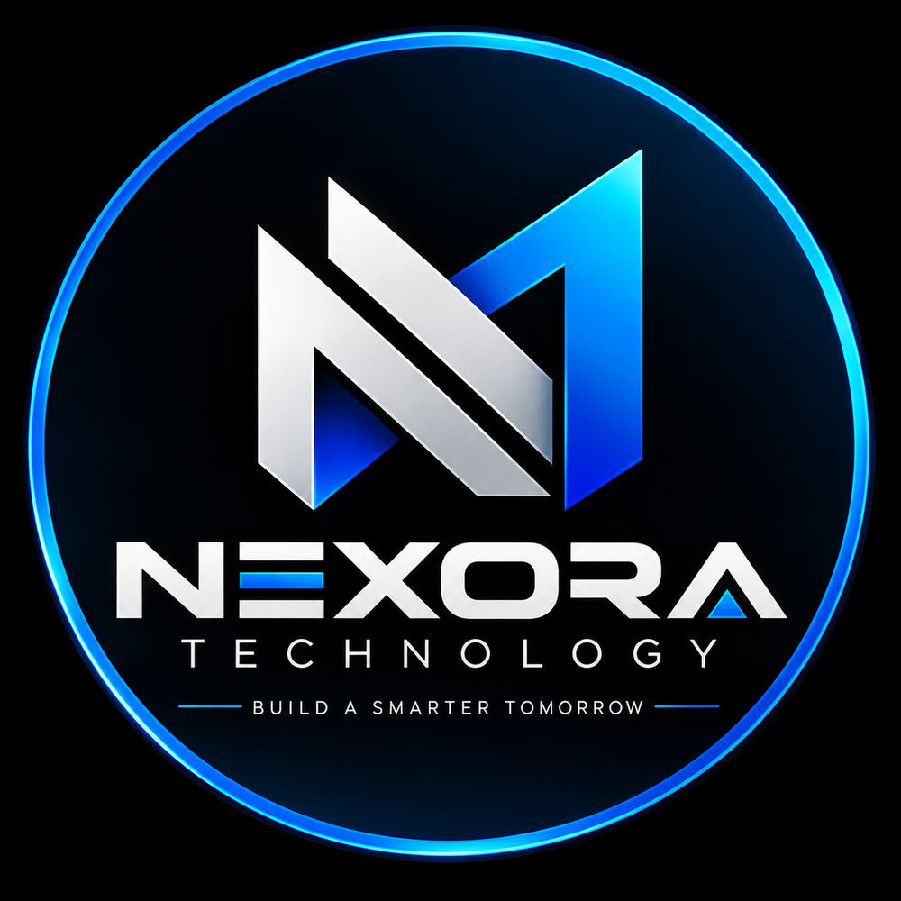

# ⚡ NEXORA Technology

<p align="center">
  <strong>BUILD A SMARTER TOMORROW.</strong><br>
  Computers · Laptops · Displays · Components · Peripherals · Technology
</p>

<p align="center">
  
</p>

<p align="center">
  <em>Premium technology for work, gaming, creativity, and everyday computing.</em>
</p>

---

## 01 · Brand Overview

**NEXORA Technology** is a modern technology retail concept created around one simple idea:

> **Technology should feel powerful, understandable, and accessible.**

NEXORA brings together computers, laptops, displays, PC components, peripherals, accessories, and essential technology products in one focused digital shopping experience.

The brand is designed to feel more like a **real technology retailer** than a generic template: structured product discovery, clear specifications, strong visual hierarchy, useful buying information, and a consistent premium identity.

### Brand Positioning

| Element | NEXORA |
|---|---|
| Brand | NEXORA Technology |
| Tagline | **Build a Smarter Tomorrow.** |
| Industry | Technology / Consumer Electronics |
| Focus | Computers, PC hardware, laptops, displays & peripherals |
| Audience | Gamers, creators, professionals, students & everyday users |
| Visual Language | Dark, precise, modern, technical |
| Accent | Electric blue |
| Deployment | Static / GitHub Pages compatible |
| Status | **Project in development** |

---

# 02 · What NEXORA Sells

NEXORA is structured around a complete PC and technology ecosystem rather than a single product category.

### 🖥 Computers & Desktops
- Gaming PCs
- Workstations
- Productivity desktops
- Compact PCs
- Creator systems
- Pre-built configurations

### 💻 Laptops
- Gaming laptops
- Business laptops
- Student laptops
- Creator laptops
- Ultrabooks
- Everyday notebooks

### 🖥 Displays
- Gaming monitors
- 4K monitors
- Ultrawide displays
- Productivity monitors
- High-refresh-rate displays
- Professional color displays

### 🎮 Graphics & Performance
- Graphics cards
- Processors
- CPU coolers
- RAM
- Motherboards
- Power supplies

### 💾 Storage
- NVMe SSDs
- SATA SSDs
- Internal storage
- External storage
- Backup drives

### 🧩 PC Components
- PC cases
- Cooling fans
- CPU coolers
- Power supplies
- Motherboards
- Memory kits
- Expansion components

### ⌨️ Peripherals
- Mechanical keyboards
- Wireless keyboards
- Gaming mice
- Productivity mice
- Headsets
- Speakers
- Webcams
- Microphones

### 🔌 Accessories
- USB hubs
- Cables
- Adapters
- Docking stations
- Laptop stands
- Desk accessories
- Controllers
- Connectivity products

---

# 03 · Customer Experience

The NEXORA storefront is intended to reproduce the important parts of a modern technology retailer.

### Product Discovery

Customers should be able to:

- Browse categories
- Search products
- Filter products
- Sort products
- Open individual product pages
- Review specifications
- Compare product characteristics
- Add products to a shopping bag
- Adjust quantities
- Remove products
- Continue shopping

### Product Presentation

Each product can contain:

- Product name
- Category
- Price
- Product image
- Short description
- Full description
- Key specifications
- Availability status
- Product badges
- Related products
- Add-to-cart action

The goal is to make every product feel like an actual retail listing rather than a decorative card.

---

# 04 · Store Architecture

The project is designed to grow beyond a single landing page.

```text
NEXORA Technology
│
├── Home
│
├── Shop
│   ├── All Products
│   ├── Computers
│   ├── Laptops
│   ├── Monitors
│   ├── Components
│   ├── Peripherals
│   └── Accessories
│
├── Product Pages
│   ├── Overview
│   ├── Specifications
│   ├── Compatibility
│   └── Related Products
│
├── Collections
│   ├── Gaming
│   ├── Work & Productivity
│   ├── Creator
│   └── Essential Setup
│
├── Buying Guides
│
├── Journal
│
├── Support
│
├── FAQ
│
├── Shipping
│
├── Returns
│
└── Contact
```

---

# 05 · Visual Identity

NEXORA uses a deliberately technical visual system.

### Primary Direction

**Dark + premium + precise + futuristic**

The visual language uses:

- Deep black
- Charcoal
- Midnight navy
- Electric blue
- White / cool gray typography
- High-contrast product photography
- Clean geometric spacing
- Subtle gradients
- Structured cards
- Technical micro-details

### Logo System

The brand identity includes:

- Primary NEXORA logo
- Dark-background logo
- Light-background logo
- Favicon
- Monogram / icon treatment

The logo should remain visually clear at both large and small sizes.

---

# 06 · Recommended Navigation

The main navigation is designed around how customers actually shop for technology:

```text
HOME
SHOP
COMPUTERS
LAPTOPS
MONITORS
COMPONENTS
PERIPHERALS
ACCESSORIES
JOURNAL
SUPPORT
```

A future production version can add:

```text
DEALS
BUILD YOUR PC
COMPARE
TRACK ORDER
ACCOUNT
```

---

# 07 · Featured Shopping Experiences

## Gaming

A dedicated destination for:

- Gaming PCs
- GPUs
- High-refresh monitors
- Mechanical keyboards
- Gaming mice
- Headsets
- Cooling
- RGB components

## Productivity

Focused on:

- Business laptops
- Office monitors
- Wireless peripherals
- Docking stations
- Webcams
- Storage
- Ergonomic accessories

## Creator

Designed around:

- High-performance CPUs
- Professional GPUs
- Color-accurate displays
- Fast SSDs
- High-memory configurations
- Creator peripherals

## Essential Setup

For customers building a complete everyday workstation:

- Computer
- Monitor
- Keyboard
- Mouse
- Headset
- Webcam
- Accessories

---

# 08 · Content & Editorial Strategy

NEXORA should not depend exclusively on product listings.

The **NEXORA Journal** provides useful technology content such as:

### Buying Guides
- How to choose a laptop
- How much RAM do you need?
- Choosing the right monitor
- SSD vs. traditional storage
- What makes a good gaming PC?

### Setup Guides
- Building a first PC
- Creating a clean desk setup
- Cable management
- Choosing a gaming monitor
- Home-office essentials

### Technical Education
- CPU vs. GPU
- Refresh rate explained
- Resolution explained
- SSD form factors
- Power supply basics
- PC cooling fundamentals

This content creates a more credible retail experience and helps customers understand products before purchasing.

---

# 09 · Trust & Service

A professional technology retailer needs more than products.

NEXORA's storefront should communicate:

### Secure Shopping
Customers should clearly understand the checkout and payment process.

### Transparent Specifications
Important technical information should be easy to find.

### Shipping Information
Shipping costs, delivery estimates, and order tracking should be clearly communicated.

### Returns
Customers should have access to a clearly written return and exchange policy.

### Warranty
Product warranty information should be available before purchase.

### Customer Support
Support channels should be visible throughout the shopping experience.

---

# 10 · Customer Support

### NEXORA Technology

**Email:** support@nexora-tech.com  
**Phone:** 1-800-555-0188  
**Hours:** Monday–Friday · 9:00 AM–6:00 PM

> The contact information above is demonstration content for this project and must be replaced with verified business information before commercial use.

Recommended future support channels:

- Email support
- Live chat
- Order tracking
- Returns center
- Technical support
- Warranty assistance
- Product compatibility assistance

---

# 11 · Technical Stack

NEXORA is intentionally lightweight and can operate as a static storefront.

### Core Technologies

- **HTML5** — semantic page structure
- **CSS3** — responsive visual system
- **JavaScript** — interactions and storefront behavior
- **JSON** — structured product/content data
- **Git** — version control
- **GitHub Pages** — static deployment

### No Heavy Framework Required

The storefront can remain framework-free where practical, reducing:

- Build complexity
- Hosting requirements
- Dependency overhead
- Deployment friction

This makes the project suitable for GitHub Pages and simple static hosting.

---

# 12 · Recommended Project Structure

```text
nexora-technology/
│
├── index.html
├── styles.css
├── app.js
├── products.json
├── README.md
├── IMAGE_CREDITS.md
├── 404.html
├── robots.txt
│
├── assets/
│   ├── brand/
│   │   ├── logo.png
│   │   ├── logo-light.png
│   │   └── favicon.png
│   │
│   ├── products/
│   │   ├── computers/
│   │   ├── laptops/
│   │   ├── monitors/
│   │   ├── components/
│   │   └── accessories/
│   │
│   ├── categories/
│   ├── journal/
│   └── ui/
│
├── data/
│   ├── products.json
│   ├── categories.json
│   ├── collections.json
│   ├── journal.json
│   ├── faq.json
│   └── site.json
│
└── docs/
    ├── STORE_CONTENT_GUIDE.md
    ├── PRODUCT_DATA_GUIDE.md
    └── DEPLOYMENT_GUIDE.md
```

---

# 13 · Product Data Model

A production-ready product catalog should keep product information separate from presentation.

Example:

```json
{
  "id": "nexora-gaming-pc-001",
  "name": "NEXORA Core X Gaming PC",
  "category": "Computers",
  "price": 1299,
  "currency": "USD",
  "availability": "In Stock",
  "description": "High-performance desktop built for modern gaming and demanding applications.",
  "specifications": {
    "cpu": "AMD Ryzen 7",
    "gpu": "NVIDIA GeForce RTX",
    "memory": "32 GB",
    "storage": "1 TB NVMe SSD"
  },
  "images": [
    "assets/products/computers/nexora-core-x.jpg"
  ]
}
```

This approach makes it easier to expand the catalog without rebuilding the entire page.

---

# 14 · Performance Standards

NEXORA should remain fast even as the catalog grows.

### Image Requirements

Product photography should be:

- Individual product images
- Properly centered
- Consistently framed
- High quality
- Optimized for web
- Free of unnecessary UI screenshots
- Free of prices/buttons embedded inside the image

Recommended image practices:

- WebP or optimized JPEG where appropriate
- Responsive image sizes
- Lazy loading below the fold
- Descriptive `alt` attributes
- Consistent aspect ratios
- Compressed assets

### Target

Avoid unnecessarily large media files. Brand assets should be optimized for practical web delivery.

---

# 15 · Accessibility

A professional storefront should also be accessible.

Recommended standards:

- Semantic HTML
- Keyboard navigation
- Visible focus states
- Descriptive image alt text
- Adequate color contrast
- Proper heading hierarchy
- Form labels
- Accessible buttons
- Accessible product dialogs
- Reduced-motion support where appropriate

---

# 16 · SEO Foundation

The storefront should include:

- Unique page titles
- Meta descriptions
- Canonical URLs
- Semantic headings
- Product structured data where appropriate
- Descriptive image filenames
- Alt text
- `robots.txt`
- Sitemap
- Clean URLs
- Open Graph metadata
- Social sharing metadata

Example homepage title:

```text
NEXORA Technology | Computers, Laptops & PC Components
```

Example description:

```text
Shop computers, laptops, monitors, PC components, peripherals and technology essentials from NEXORA Technology.
```

---

# 17 · Security

GitHub Pages is appropriate for static frontend hosting, but a real e-commerce system requires additional infrastructure.

### Never store in frontend code:

- Payment secret keys
- Private API keys
- Database credentials
- Authentication secrets
- Administrative tokens
- Shipping provider secrets

### Production architecture

A future production implementation should separate:

```text
Frontend
    ↓
Secure API / Backend
    ↓
Database
    ↓
Payment Provider
    ↓
Order / Inventory System
```

---

# 18 · Payments & Checkout

The current static storefront can provide the visual shopping experience and cart interface.

For real transactions, integrate a secure payment provider and backend.

A production checkout should support:

- Cart validation
- Customer information
- Shipping address
- Tax calculation
- Shipping method
- Secure payment
- Order creation
- Confirmation email
- Inventory reservation
- Refund handling
- Order tracking

The frontend alone should **never** process or store sensitive card information.

---

# 19 · Future Integrations

Potential production integrations include:

- Secure payment provider
- Inventory management
- Shipping provider
- Tax service
- Customer accounts
- Order tracking
- Product reviews
- Search engine
- Product comparison
- Wishlist
- Email marketing
- Analytics
- Customer support platform

---

# 20 · Development Roadmap

## V1 — Foundation

- Brand identity
- Homepage
- Product catalog
- Responsive layout
- Core navigation
- Product cards

## V2 — Retail Experience

- Expanded product catalog
- Search
- Filters
- Product detail experience
- Shopping bag
- Related products
- Journal
- Buying guides
- Support content

## V3 — Commerce Experience

- Production checkout
- Payment integration
- Inventory
- Customer accounts
- Order history
- Tracking
- Returns center

## V4 — Advanced Platform

- Product comparison
- Wishlist
- Personalized recommendations
- Advanced search
- Reviews
- Technical compatibility tools
- PC build configurator

---

# 21 · GitHub Repository

**Owner:** `kamachgroup-com`

**Repository:** `nexora-technology`

**Repository description:**

> NEXORA Technology — Computers, laptops, monitors, PC components, accessories, and modern technology solutions.

### Expected GitHub Pages URL

```text
https://kamachgroup-com.github.io/nexora-technology/
```

The exact public URL depends on the repository's GitHub Pages configuration.

---

# 22 · Deployment

To deploy the static storefront:

1. Create the repository.
2. Keep the repository **Public** if using the intended free GitHub Pages setup.
3. Upload the project files to the repository root.
4. Make sure `index.html` is located at the root.
5. Open **Settings → Pages**.
6. Select the appropriate branch.
7. Select the root folder (`/`).
8. Save the configuration.
9. Wait for GitHub Pages to publish the site.
10. Open the generated Pages URL.

### Important

Do **not** upload only the ZIP file if GitHub Pages is expected to serve the website directly.

The contents of the ZIP should be extracted and uploaded so that:

```text
index.html
```

is directly inside the repository root.

---

# 23 · Image & Asset Licensing

Third-party assets must be reviewed before commercial deployment.

`IMAGE_CREDITS.md` should document:

- Source URL
- Creator when available
- Asset name
- License information
- Intended usage
- Attribution requirements

Before launch, verify the current licensing terms for every external image, icon, font, logo, and photograph.

NEXORA should never present third-party copyrighted product photography as original NEXORA photography without appropriate rights.

---

# 24 · Content Policy for Product Listings

Product information should be factual and transparent.

Avoid:

- Invented certifications
- Fake customer reviews
- Fake stock counts
- Misleading discounts
- False manufacturer claims
- Unverified technical specifications
- Artificial urgency

If a specification is unknown, it should be verified before publication.

---

# 25 · Production Checklist

Before launching NEXORA commercially:

### Brand
- [ ] Final logo approved
- [ ] Favicon installed
- [ ] Brand colors finalized
- [ ] Typography finalized

### Products
- [ ] Product names verified
- [ ] Prices verified
- [ ] Specifications verified
- [ ] Images licensed
- [ ] Inventory connected

### Store
- [ ] Search tested
- [ ] Filters tested
- [ ] Product pages tested
- [ ] Cart tested
- [ ] Mobile layout tested
- [ ] Checkout tested

### Business
- [ ] Real support email
- [ ] Real phone number
- [ ] Shipping policy
- [ ] Return policy
- [ ] Warranty policy
- [ ] Privacy policy
- [ ] Terms of service

### Technical
- [ ] HTTPS enabled
- [ ] SEO metadata
- [ ] Sitemap
- [ ] Robots file
- [ ] Analytics
- [ ] Error page
- [ ] Performance testing
- [ ] Accessibility testing

---

# 26 · Project Status

**Current status:** 🟡 **Project in development**

NEXORA is being developed as a premium technology retail experience with a strong foundation for future commerce functionality.

The static storefront is suitable for design, catalog, navigation, content, and frontend development. Secure backend services and payment infrastructure are required before accepting real customer payments.

---

# 27 · Vision

NEXORA is not intended to be simply another online computer store.

The long-term goal is to create a technology destination where customers can:

**Discover → Understand → Compare → Choose → Build → Buy → Get Support**

Every part of the experience should make technology easier to understand while maintaining a premium, modern retail presentation.

> **NEXORA Technology**  
> **Build a Smarter Tomorrow.**

---

## License & Commercial Notice

This project is a proprietary storefront concept for NEXORA Technology unless a separate license is provided.

Third-party assets remain subject to their respective licenses and ownership rights.

The information, products, prices, contact details, and technical examples used during development may be demonstration content and should be verified before commercial publication.

---

<p align="center">
  <strong>© 2026 NEXORA Technology. All rights reserved.</strong>
</p>


# NEXORA V2 Storefront

The V2 storefront expands the original concept into a richer retail experience with 18 products, curated collections, a PC builder, wishlist, comparison tray, product quick views, richer support content, customer-voice content, deal modules, search, sorting, persistent cart behavior, and an expanded content/data architecture.

## V2 Interactive Features

- Product search with keyboard shortcut (`Ctrl/Cmd + K`)
- Category filtering
- Product sorting
- Product quick view
- Wishlist saved in local browser storage
- Product comparison tray for up to three items
- Persistent shopping bag
- Quantity controls
- PC builder starting-point generator
- FAQ accordions
- Newsletter confirmation
- Order request email flow
- Responsive layouts

## V2 Content Expansion

- 18 product records
- 6 categories
- 4 curated collections
- 3 upgrade/deal modules
- 6 journal entries
- 6 FAQ entries
- 3 customer-voice entries
- Expanded documentation and content inventory

## Commercial Note

This is still a static storefront concept. Prices, reviews, contact details, inventory, shipping terms, warranties, policies and product specifications must be verified and connected to production systems before commercial use.
